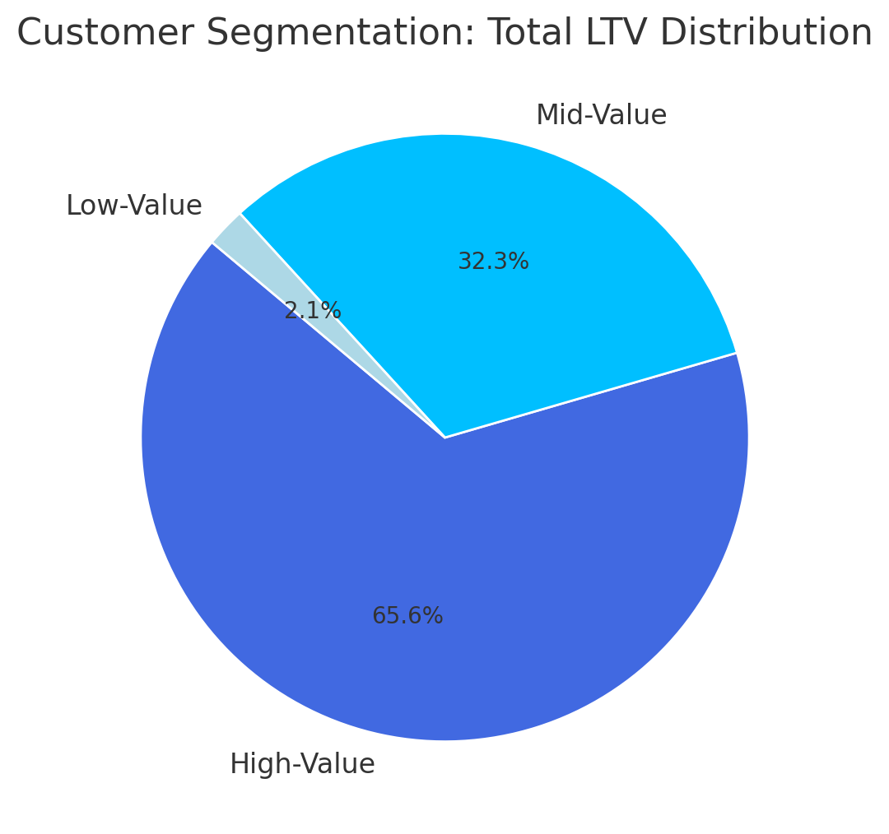

# Contoso Sales Analysis

## Overview

Welcome to my analysis of customer behavior, retention, and lifetime value for an e-commerce company to improve customer retention and maximize revenue.

For this project, I am using the Contoso dataset, a sample database provided by Microsoft that simulates data from a fictional multinational company, Contoso Ltd. The dataset is widely used for learning and demonstrating SQL skills, business intelligence, and data analysis techniques.

It contains a wide range of realistic business data, including:

- Sales (orders, customers, territories, stores)

- Products (categories, subcategories, product details)

- Finance (revenues, costs, profits)

- Time (date and time dimensions for reporting)

Using this dataset allows me to work with complex queries, explore business metrics, and practice transforming raw data into meaningful insights.

## Business Questions

1. Customer Segmentation: Who are our most valuable customers ?

2. Cohort Analysis: How do different customer groups generate revenue ?

3. Retention Analysis: Which customers haven't purchased recently ?

## Tools I Used

1. PostgreSQL: Used as the main database system to store and manage the Contoso dataset.

2. DBeaver: Served as the database client for writing and executing SQL queries.

3. Visual Studio Code: Used for editing SQL scripts and documenting the project.

4. Git: Used for version control and tracking changes throughout the development of the project.

# The View

```sql
CREATE VIEW cleaned_customer AS
WITH cohort_data AS (
    SELECT 
        s.customerkey,
        c.countryfull, 
        c.age,
        c.givenname,
        c.surname,
        MIN(s.orderdate) OVER (PARTITION BY s.customerkey) AS first_purchase_date,
        EXTRACT(YEAR FROM MIN(s.orderdate) OVER (PARTITION BY s.customerkey)) AS cohort_year,
        s.orderdate,
        COUNT(s.orderkey) AS num_orders,
        SUM(s.quantity* s.netprice * s.exchangerate) AS total_net_revenue
    FROM sales s
    LEFT JOIN customer c ON c.customerkey = s.customerkey
    GROUP BY 
        s.customerkey, 
        c.countryfull, 
        c.age, 
        c.givenname, 
        c.surname,
        s.orderdate
)

SELECT
    cd.customerkey, 
    cd.cohort_year,
    CONCAT(TRIM(cd.givenname), ' ', TRIM(cd.surname)) AS cleaned_name, 
    COALESCE(cd.num_orders, 0) AS num_orders,
    COALESCE(cd.total_net_revenue, 0) AS net_revenue,
    cd.countryfull,
    cd.age,
    cd.first_purchase_date,
    cd.orderdate
FROM cohort_data cd;
```

## Importance of Views in SQL

1. Abstraction & Simplification

Views allow you to hide complex SQL logic behind a simple interface. Instead of repeating joins, calculations, or window functions every time, you create the view once and query it like a table.

2. Code Reusability

A well-designed view like cleaned_customer can be reused across multiple reports, dashboards, or analytics jobs. It centralizes logic such as cohort analysis and revenue calculation, making your codebase DRY (Don’t Repeat Yourself).

3. Security and Access Control

You can expose only specific columns or rows via views, restricting access to sensitive data while still allowing analysis. For instance, if your customer table contains sensitive identifiers, a view can mask them.

4. Data Consistency

Views ensure consistent logic. For instance, the revenue computation logic (SUM(quantity * netprice * exchangerate)) will always be consistent wherever the view is used.

5. Performance Optimization

Although not always faster, views can be optimized if used with materialized views (where supported). Even regular views can help guide the optimizer by simplifying complex queries.

6. Maintainability

When business logic changes (e.g., how net revenue is calculated), updating the view in one place updates all dependent queries. That’s a huge win for long-term maintenance.


## Analysis Approach

## 1. Customer Segmentation Analysis

- Categorized customers based on total lifetime value (LTV)

- Assigned customers to High, Mid, and Low-value segments

- Calculated key metrics: total revenue

## The Query

```sql
WITH customer_ltv AS (
	SELECT
		customerkey,
		cleaned_name,
		SUM(total_net_revenue) AS total_ltv
	FROM cohort_analysis
	GROUP BY
		customerkey,
		cleaned_name
), customer_segments AS (
	SELECT
		PERCENTILE_CONT(0.25) WITHIN GROUP (ORDER BY total_ltv) AS ltv_25th_percentile,
		PERCENTILE_CONT(0.75) WITHIN GROUP (ORDER BY total_ltv) AS ltv_75th_percentile
	FROM customer_ltv 
), segment_values AS (
	SELECT
		c.*,
		CASE
			WHEN c.total_ltv < cs.ltv_25th_percentile THEN '1 - Low-Value'
			WHEN c.total_ltv <= cs.ltv_75th_percentile THEN '2- Mid-Value'
			ELSE '3 - High-Value'
		END AS customer_segment
	FROM customer_ltv c,
		customer_segments cs
)
SELECT
	customer_segment,
	SUM(total_ltv) AS total_ltv,
	COUNT(customerkey) AS customer_count,
	SUM(total_ltv) / COUNT(customerkey)
FROM segment_values
GROUP BY
	customer_segment
ORDER BY
	customer_segment DESC
```

## Visualization


*Customer Segmentation by Lifetime Value (LTV): High, Mid, and Low-Value Distribution.*

### Key Findings

- High-value segment (25% of customers) drives 66% of revenue ($135.4M)

- Mid-value segment (50% of customers) generates 32% of revenue ($66.6M)

- Low-value segment (25% of customers) accounts for 2% of revenue ($4.3M)

### Business Insights

- High-Value (66% revenue): Offer premium membership program to 12,372 VIP customers, as losing one customer significantly impacts revenue

- Mid-Value (32% revenue): Create upgrade paths through personalized promotions, with potential $66.6M → $135.4M revenue opportunity

- Low-Value (2% revenue): Design re-engagement campaigns and price-sensitive promotions to increase purchase frequency

## 2. Cohort Analysis

- Tracked revenue and customer count per cohorts

- Cohorts were grouped by year of first purchase

- Analyzed customer retention at a cohort level

## The Query

```sql
SELECT 
	cohort_year,
	COUNT(DISTINCT customerkey ) AS total_customers,
	SUM(total_net_revenue) AS total_revenue,
	SUM(total_net_revenue)/COUNT(DISTINCT customerkey) AS customer_revenue
FROM cohort_analysis
WHERE orderdate = first_purchase_date 
GROUP BY 
	cohort_year
```

## Visualization


*Customer Revenue Trends by Cohort Year (Adjusted for Time in Market)*

### Key Findings

- Revenue per customer shows an alarming decreasing trend over time 
    - 2022-2024 cohorts are consistently performing worse than earlier cohorts
    - NOTE: Although net revenue is increasing, this is likely due to a larger customer base, which is not reflective of customer value

### Business Insights

- Value extracted from customers is decreasing over time and needs further investigation.

- In 2023 we saw a drop in number of customers acquired, which is concerning.

- With both lowering LTV and decreasing customer acquisition, the company is facing a potential revenue decline.

## 3. Customer Retention

## The Query

```sql
WITH customer_last_purchase AS (
	SELECT
		customerkey,
		cleaned_name,
		orderdate,
		ROW_NUMBER() OVER (PARTITION BY customerkey ORDER BY orderdate DESC) AS rn,
		first_purchase_date,
		cohort_year
	FROM
		cohort_analysis
), inactive_customers AS (
	SELECT
		customerkey,
		cleaned_name,
		orderdate AS last_purchase_date,
		CASE
			WHEN orderdate < (SELECT MAX(orderdate) FROM sales) - INTERVAL '6 months' THEN 'Churned'
			ELSE 'Active'
		END AS customer_status,
		cohort_year
	FROM customer_last_purchase 
	WHERE rn = 1
		AND first_purchase_date < (SELECT MAX(orderdate) FROM sales) - INTERVAL '6 months'
)
SELECT
	cohort_year,
	customer_status,
	COUNT(customerkey) AS num_customers,
	SUM(COUNT(customerkey)) OVER(PARTITION BY cohort_year) AS total_customers,
	ROUND(COUNT(customerkey) / SUM(COUNT(customerkey)) OVER(PARTITION BY cohort_year), 2) AS status_percentage
FROM inactive_customers 
GROUP BY cohort_year, customer_status
```

- Identified customers at risk of churning

- Analyzed last purchase patterns

- Calculated customer-specific metrics

## Visualization


*Trends in Customer Retention vs. Churn by Cohort Year*

### Key Findings

- Cohort churn stabilizes at ~90% after 2-3 years, indicating a predictable long-term retention pattern.

- Retention rates are consistently low (8-10%) across all cohorts, suggesting retention issues are systemic rather than specific to certain years.

- Newer cohorts (2022-2023) show similar churn trajectories, signaling that without intervention, future cohorts will follow the same pattern.

### Business Insights

- Strengthen early engagement strategies to target the first 1-2 years with onboarding incentives, loyalty rewards, and personalized offers to improve long-term retention.


- Re-engage high-value churned customers by focusing on targeted win-back campaigns rather than broad retention efforts, as reactivating valuable users may yield higher ROI.

- Predict & preempt churn risk and use customer-specific warning indicators to proactively intervene with at-risk users before they lapse.

# Strategic Recommendations

1. Customer Value Optimization (Customer Segmentation)

    - Launch VIP program for 12,372 high-value customers (66% revenue)

    - Create personalized upgrade paths for mid-value segment ($66.6M → $135.4M opportunity)

    - Design price-sensitive promotions for low-value segment to increase purchase frequency

2. Cohort Performance Strategy (Customer Revenue by Cohort)

    - Target 2022-2024 cohorts with personalized re-engagement offers

    - Implement loyalty/subscription programs to stabilize revenue fluctuations

    - Apply successful strategies from high-spending 2016-2018 cohorts to newer customers

3. Retention & Churn Prevention (Customer Retention)

    - Strengthen first 1-2 year engagement with onboarding incentives and loyalty rewards

    - Focus on targeted win-back campaigns for high-value churned customers

    - Implement proactive intervention system for at-risk customers before they lapse

# What I Learned

1. Advanced Query Building & Data Modeling

I strengthened your ability to write complex SQL queries using CTEs (Common Table Expressions), window functions, and aggregations. Creating reusable views like cleaned_customer also shows your understanding of data modeling and how to structure queries for clarity and reusability.

2. Analytical Thinking with Business Context

I learned how to translate business questions into SQL logic, like identifying churned customers or calculating customer segments by LTV. This demonstrates your skill in turning raw data into actionable insights, which is key for any data analyst or BI role.

3. Data Cleaning & Consistency Techniques

I practiced cleaning and standardizing data directly in SQL—like formatting customer names, handling NULLs with COALESCE, and ensuring consistent calculations for revenue. These skills are essential for ensuring data quality and consistency across reports and dashboards.

# Challenges I Faced

- Data Complexity & Relationships : The Contoso dataset contains multiple interconnected tables (sales, customers, products, finance, time), which required a deep understanding of table relationships and foreign keys to join data accurately without duplication or loss of information.

- Handling Inconsistent or Missing Data : The Contoso dataset contains multiple interconnected tables (sales, customers, products, finance, time), which required a deep understanding of table relationships and foreign keys to join data accurately without duplication or loss of information.

- Translating Data into Actionable Insights : Turning SQL query results into meaningful business insights was challenging. It required not just technical execution but also the ability to interpret trends and propose data-driven strategies for customer retention and revenue growth.

# Conclusion 

This project allowed me to apply advanced SQL techniques to analyze real-world business challenges using the Contoso dataset. By exploring customer segmentation, cohort behavior, and retention patterns, I was able to generate actionable insights to support strategic decision-making around customer value optimization and churn prevention.

Through this analysis, I deepened my skills in data modeling, query optimization, and business-oriented thinking. More importantly, I reinforced the importance of clean, well-structured SQL code and its role in transforming complex datasets into meaningful narratives that drive business growth.

This experience not only strengthened my technical foundation but also enhanced my ability to think critically and communicate data-driven insights effectively.


